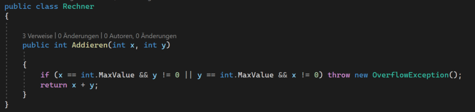
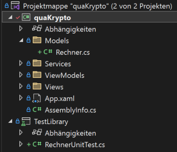
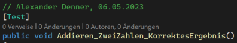
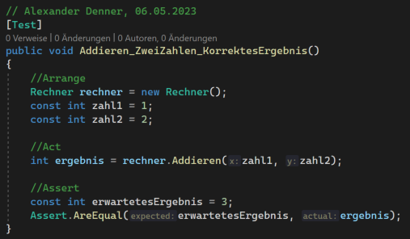
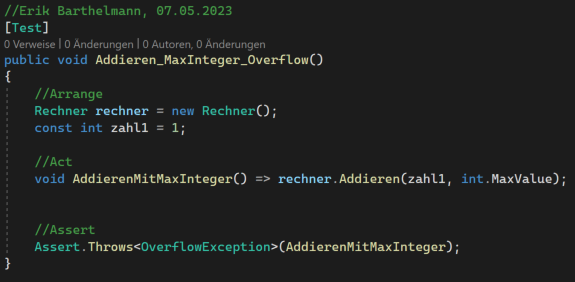
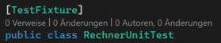
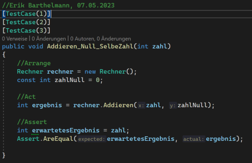

# Testing Guidelines
Wir haben ein paar grundlegende Testrichtlinien zusammengestellt, die das Erstellen von Tests vereinheitlichen soll, damit sich jeder schnell und besser in dem Testprojekt zurechtfindet und die Tests versteht.

Die Beispiele aus diesem Dokument sind auch im Projekt zu finden. Die Klasse, die jeweils getestet wird, heißt `Rechner`. Sie besitzt folgende Methode:  

## Allgemeine Hinweise
1. Für das Schreiben unserer Tests verwenden wir das NUnit Framework
1. Software kann nie 100 % Bugfrei werden, daher...
1. ... beachtet die Zeit die ihr für das Testen investiert (Nicht zu viel nicht zu wenig)
1. Private Methoden müssen nicht direkt getestet werden. Sie sollen über die Tests der Öffentlichen Methoden verifiziert werden

## Richtlinien für Unit- und Integrationstest
1. Die Tests werden von den Entwicklern geschrieben und ausgeführt
1. Für jede Klasse soll eine Testklasse im TestProjekt (TestLibrary) erstellt werden. Darin werden dann die Unit-Tests geschrieben. Für die Testklasse gibt es folgende Namenskonvention: `{Klassenname}UnitTest` 
*Siehe folgender Struktur:* 
1. Die Tests sollen eine Dokumentation haben (Mindestens Name des Erstellers und Datum)
1. Die Testfunktion sollen sprechend benannt werden dafür soll folgendes Namenskonvention benutzt werden: 
    - Name der zu testenden Methode
    - Was getestet werden soll (Testszenario)
    - Das zu erwartende Verhalten/Ergebnis 
    *Bsp.:* 
1. Variablen sollen sprechend benannt werden
1. Konstanten sollen durch sprechende Variablennamen definiert werden (Keine Magic Number oder Magic Strings)
1. Test werden in 3 verschiedene Blöcke unterteilt. (Arrange, Act, Assert) 
*Bsp.:* 
1. Beim Testen sollen auch Eingaben geprüft werden die nicht vorhergesehen sind 
*Bsp.:* 
1. Tests sollen so geschrieben werden, dass keine Logikabfragen oder Schleifen genutzt werden
    - Anstatt eine Schleife für verschiedene Eingaben können `[TestCase(eingabe)]` genutzt werden
    - Anstatt eine Logikabfrage sollen verschiedene Testfälle erstellt werden
1. **Unit-Tests** sollen so geschrieben werden, dass in ihrem Act abschnitt jeweils nur eine Sache gemacht wird. (Ergo jede Testfunktion soll nur eine Sache testen)

## NUnit - Das Test Framework
NUnit ist ein Framework, dass genutzt wird, um Test zu schreiben und automatisiert auszuführen.
Es gibt verschiedene Attribute die NUnit nutzt.

### `[TestFixture]`
Dieses Attribut wird über die TestKlasse geschrieben. 
*Bsp.:* 

### `[Test]` 
Dieses Attribut wird genutzt um eine Testfunktion zu markieren. 
Bsp.: Siehe oben
### `[TestCase(input)]` 
Dieses Attribut kann auch genutzt werden, um Testfunktionen zu definieren. Hier kann man aber Eingabeparameter mit angeben. Sie können auch mehrfach über der Testfunktion stehen. Somit können verschiedene Eingaben getestet werden. Der Test wird dann einmal mit jedem Eingabeparameter ausgeführt 
*Bsp.:* 